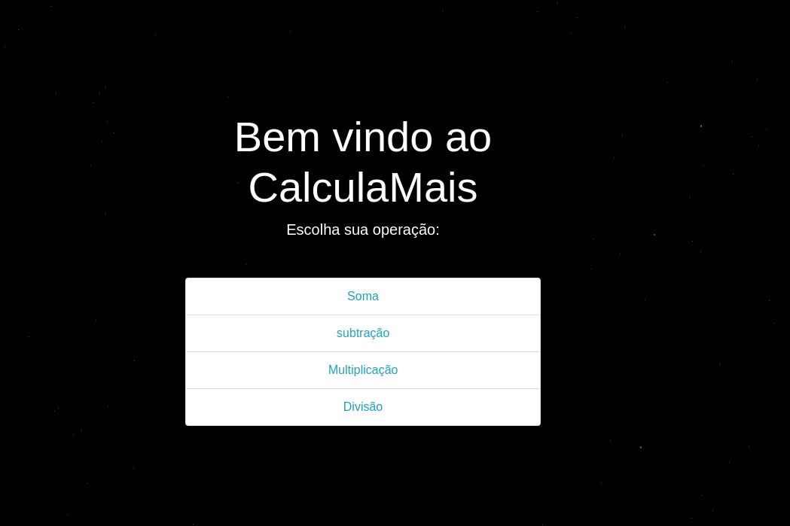

# Projeto calculadora

Esse é um projeto em Django, o objetivo é se acostumar com o framework e realizar algumas operações básicas.

## Forma de usar:

Basta clonar esse repositório, recomendo que crie um ambiente virtual:

```shell
python3 -m venv projetosDjango 
```

ativando o ambiente virtual:

```shell
source projetosDjango/bin/activate 
```

Agora será necessário instalar o Django:

```shell
pip install django
```

Para iniciar o software basta usar o comando:

```shell
python manage.py runserver
```

Dessa forma, o servidor será inicializado na porta 8000.




## Histórico de versões

Versão 0.1 - Criação do projeto:
    - rotas para as operações de soma, divisão, multiplicação e subtração.
    - Só pode realizar uma operação em cada rota.
  