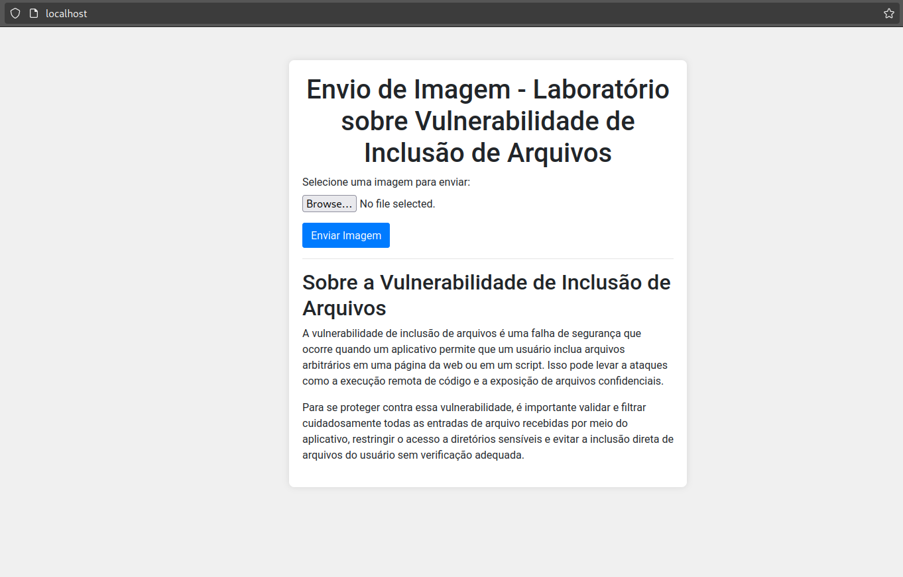
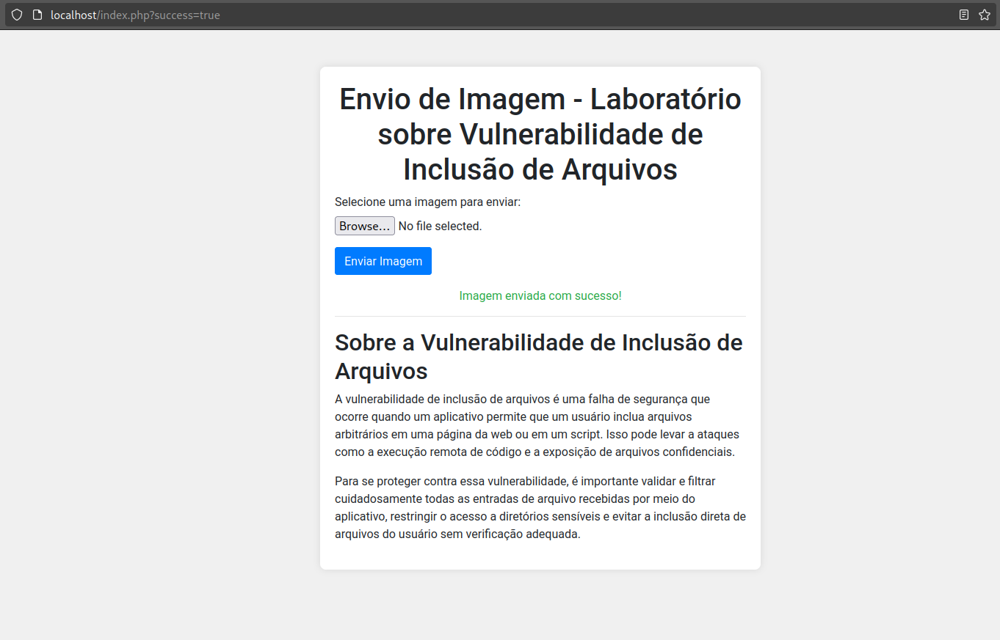
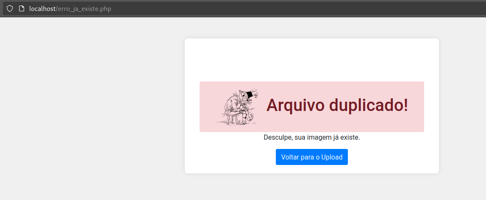
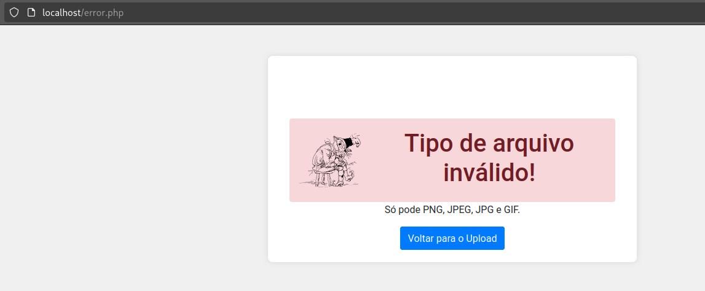

# File inclusion

Esse é um laboratório que é vulnerável. O foco dele é explorar a vulnerabilidade **file inclusion**.

## Documentação do docker-compose.yml

O arquivo `docker-compose.yml` é utilizado para iniciar uma aplicação web com um banco de dados MySQL usando Docker Compose.

**1. Versão:**

- `version: '3'`: Define a versão do formato do arquivo `docker-compose.yml`. A versão 3 é a versão atualmente recomendada.

**2. Serviços:**

- A seção `services` define os serviços que serão executados no ambiente Docker Compose.

  - **web:**
    - `build`: Instrui o Docker Compose a construir a imagem do serviço `web` a partir do Dockerfile localizado no diretório atual (`context: '.'`).
    - `dockerfile`: Especifica o nome do Dockerfile usado para construir a imagem do serviço web.
    - `ports`: Mapeia a porta 80 do container para a porta 80 da máquina host, possibilitando acesso externo à aplicação web.
    - `volumes`: Monta o diretório local `./site` no diretório `/var/www/html` dentro do container, tornando o conteúdo do diretório local acessível à aplicação web.
    - `networks`: Define que o serviço `web` deve participar da rede `app-network` (criada posteriormente).

  - **mysql:**
    - `image`: Informa que o serviço `mysql` utilizará a imagem oficial do MySQL versão 5.7 (`mysql:5.7`).
    - `environment`: Define variáveis de ambiente para o container MySQL:
      - `MYSQL_ROOT_PASSWORD`: Define a senha do usuário root do MySQL (`P@ssw0rd!123`).
      - `MYSQL_DATABASE`: Define o nome do banco de dados a ser criado (`mysql`).
      - `MYSQL_USER`: Define o nome de usuário para acesso ao banco de dados (`kali`).
      - `MYSQL_PASSWORD`: Define a senha do usuário `kali` (`k@l!`).
    - `ports`: Mapeia a porta 3306 do container para a porta 3306 da máquina host, permitindo acesso externo ao banco de dados MySQL.
    - `volumes`: Monta o diretório local `./data` no diretório `/var/lib/mysql` dentro do container, persistindo os dados do banco de dados entre reinicializações do container.
    - `networks`: Define que o serviço `mysql` deve participar da rede `app-network`.

**3. Redes:**

- A seção `networks` define as redes virtuais que os serviços podem utilizar para se comunicarem entre si.

  - `app-network`:
    - `driver`: Define o driver da rede (`bridge`), que cria uma rede virtual conectada à rede física da máquina host.

**4. Como Iniciar a Aplicação:**

1. **Pré-requisitos:** Certifique-se de ter o Docker e o Docker Compose instalados em sua máquina.
2. **Posicione o arquivo:** Salve o conteúdo explicado acima em um arquivo nomeado `docker-compose.yml` no diretório do seu projeto.
3. **Ajuste as Variáveis:** Se necessário, modifique as variáveis de ambiente do serviço `mysql` de acordo com suas preferências.
4. **Iniciar os Serviços:** Abra um terminal no diretório do projeto e execute o seguinte comando:

   ```bash
   docker-compose up -d
   ```

   - `docker-compose`: Comando para executar o Docker Compose.
   - `up`: Instrução para iniciar os serviços definidos no arquivo `docker-compose.yml`.
   - `-d`: Opção para executar os serviços em detached mode (em segundo plano).

## Documentação do Site de Upload de Imagens

Este site permite que você envie imagens para um servidor. O script PHP processa o envio e exibe mensagens de sucesso ou erro de acordo com o resultado.



### Uso

1. **Acessar o Site:** Acesse o site no seu navegador web, navegando para `http://localhost`.
2. **Selecionar Imagem:** Clique no botão "Browse..." e escolha a imagem que deseja enviar do seu computador.
3. **Enviar Imagem:** Clique no botão "Enviar Imagem".
4. **Resultado:** O script irá processar o envio e exibir uma mensagem de sucesso ou erro.

### Funcionalidades

- **Envio de Imagens:** Selecione um arquivo de imagem (máximo 5MB) e clique no botão "Enviar".
- **Validação de Arquivos:** O script verifica se o arquivo é uma imagem real, se já existe no servidor e se o formato é válido (JPG, PNG, JPEG ou GIF).
- **Mensagens de Feedback:** O script exibe mensagens de sucesso ou erro informando o resultado do envio.

No caso de sucesso a mensagem é a seguinte:

### Mensagens de Resultado

- **Sucesso:** "Sua imagem foi enviada com sucesso!"


  
- **Erro - Arquivo já existe:** "O arquivo já existe no servidor. Tente outro nome."
  
- **Erro - Tamanho do arquivo:** "Desculpe, sua imagem é muito grande. O tamanho máximo permitido é de 5MB."
- **Erro - Formato de arquivo inválido:** "O formato de arquivo enviado não é válido. Permitidos: JPG, PNG, JPEG ou GIF."
  
- **Erro - Falha no envio:** "Desculpe, ocorreu um erro ao enviar sua imagem. Tente novamente mais tarde."

### Recursos Adicionais

- Documentação do PHP: [https://www.php.net/docs.php](https://www.php.net/docs.php)
- Função `move_uploaded_file()`: [https://www.php.net/manual/en/function.move-uploaded-file.php](https://www.php.net/manual/en/function.move-uploaded-file.php)
- Validação de Formato de Arquivo: [https://www.php.net/manual/en/function.getimagesize.php](https://www.php.net/manual/en/function.getimagesize.php)

### Suporte

Em caso de dúvidas ou problemas com o site, consulte a documentação fornecida ou busque ajuda em fóruns ou comunidades online de desenvolvimento web.

**5. Considerações Adicionais:**

- Este exemplo demonstra uma configuração básica. Você pode precisar adaptá-la de acordo com sua aplicação específica.
- Para parar os serviços em execução, execute `docker-compose down`.
- Para visualizar logs dos serviços, utilize `docker-compose logs <serviço>`.

**Esperamos que esta documentação ajude você a entender e utilizar o arquivo `docker-compose.yml` para executar sua aplicação web com banco de dados MySQL usando Docker Compose.**

## Possíveis problemas

Se ao subir o lab e não estiver salvando a imagem será necessário entrar no container do servidor

```shell
docker exec -it id_container bash
```

 e executar o seguinte comando:

 ```shell
 chown www-data:www-data /var/www/html/uploads
 ```
